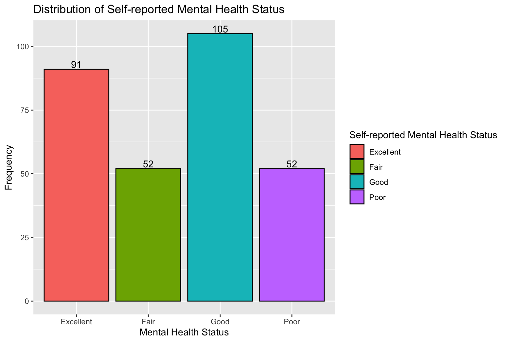
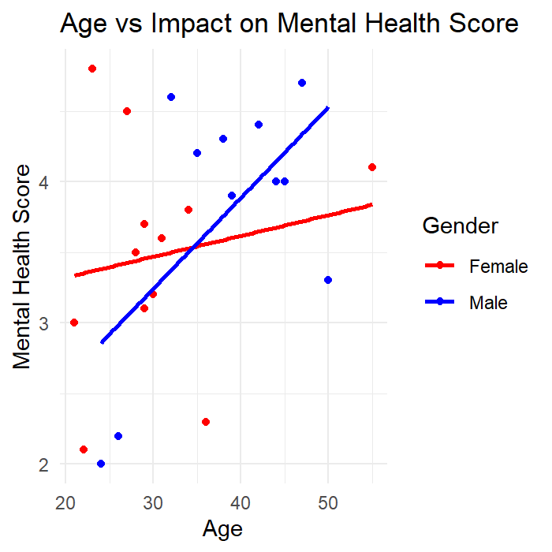
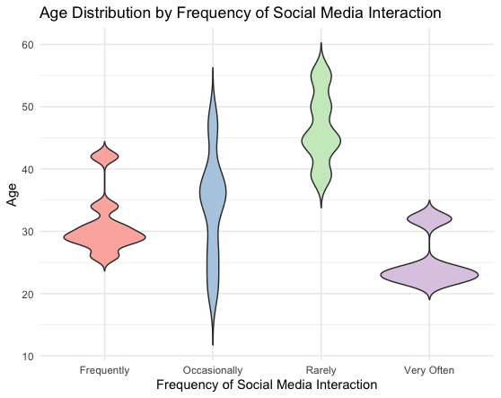

## Project title

How screen time affects mental health

### Authors

Koh Micek ([Kmicek\@uw.edu](mailto:Kmicek@uw.edu){.email}), Austin Shin
([joongsuk\@uw.edu](mailto:joongsuk@uw.edu){.email}), Vitchayah
Srisopaporn ([sriv0124\@uw.edu](mailto:sriv0124@uw.edu){.email}), David
Song ([dsong3\@uw.edu](mailto:dsong3@uw.edu){.email})

### Date

Spring 2024

### Abstract

Our main question is, how does the amount of social media usage affect
the user's mental health? This question is important because with the
recent rise of social media users increasing, and the age of users
becoming younger, having bad mental health at a younger age can hinder
their growth in a bad way. We decided to touch on this topic since
social media usage has increased over the years, and we believe it will
only keep on increasing, leading to more people with mental health
issues, and people with these mental health issues getting younger.

### Keywords

Social media, mental health, age, gender, interation.

### Introduction

In the digital age, social media has become a central part of everyday
life for millions of people around the world. While it offers
unprecedented opportunities for communication and information sharing,
there is growing concern about its impact on mental health. Our project
aims to analyze user behavior on social media platforms and assess its
correlation with various mental health outcomes. By leveraging data from
surveys and digital usage metrics, we intend to create an interactive
web application that visualizes these relationships and provides
insights into how digital habits influence mental well-being. Some
research question we have are;

How does the amount of time spent on social media correlate with
reported levels of anxiety and depression among different age groups? We
believe this is important since this question addresses public health
concerns and can inform policy decisions regarding digital literacy and
mental health support systems. It motivates us since with rising screen
time, understanding its impact on mental health can help in developing
guidelines for healthier social media consumption.

What are the effects of social media interactions (likes, shares,
comments) on the self-esteem of individuals? It motivates us since these
datas are difficult to see, and social validation is a significant
aspect of social media usage; studying its effects on self-esteem can
illuminate psychological impacts that may not be immediately apparent.
And it's important, since Insights from this analysis can aid mental
health professionals in creating interventions that help users maintain
healthy relationships with digital platforms.

Does the nature of content consumed (positive vs. negative news) on
social media affect the user's mood and mental health status? This
question is important since it's one of the direct contents that can
affect the mental health directly, and exposure to different types of
content could have varying impacts on mood, which in turn affects
overall mental health.

Are there significant differences in mental health impacts between
various social media platforms? Our motivation to this is because
different platforms have different user experiences and content types,
which might influence mental health differently. And it's important to
ask this question since this question can guide users in choosing their
digital environments more wisely and encourage platforms to modify
features that may negatively affect mental health.

### Related Work

Twenge, J. M., Joiner, T. E., Rogers, M. L., & Martin, G. N. (2018).
Increases in depressive symptoms, suicide-related outcomes, and suicide
rates among U.S. adolescents after 2010 and links to increased new media
screen time. Journal of Abnormal Psychology, 127(1), 6--17.

This study provides evidence linking increased screen time with rising
rates of depression and suicide-related outcomes among adolescents. It
highlights the potential dangers of excessive digital engagement.
"<https://psycnet.apa.org/record/2017-56836-001>"

"How Does Social Media Affect Your Well-Being?" by Amy Orben (2019),
published by BBC Future.

Orben discusses the complex ways in which social media can affect mental
health, including issues related to self-esteem and social comparison.
This article provides a balanced view, noting both the potential harms
and benefits of social media usage.
"<https://www.bbc.com/future/article/20190104-how-much-is-social-media-affecting-your-real-life>"

Lin, L. Y., Sidani, J. E., Shensa, A., Radovic, A., Miller, E., Colditz,
J. B., Hoffman, B. L., & Primack, B. A. (2016). Association between
social media use and depression among U.S. young adults. Depression and
Anxiety, 33(4), 323-331.

This research examines the association between social media use and
depression among young adults in the U.S., suggesting that high levels
of social media engagement can significantly increase the risk of
developing depression.
<https://onlinelibrary.wiley.com/doi/full/10.1002/da.22466>" These
studies and articles provide a foundation for our research, offering
insights into methodologies for data collection and analysis, as well as
previous findings that we can build upon to further understand the
relationship between social media usage and mental health. By
integrating these perspectives, our project aims to contribute valuable
new knowledge to this important field.

### The Dataset

The data was found on Mendeley Data
(<https://data.mendeley.com/datasets/jxkcm7s638/1>). The data was
collected by John Ngugi from the Kisii University College Faculty of
Health Sciences. This data was collected through online surveys
performed by the Kisii University College Faculty of Health Sciences
throughout the campus. This survey was done to determine participant
behaviors on the subjects of mental health and how much they use social
media as well as a score of social media's impact on mental health.
There are 300 observations (rows) in the data. There are six features
(columns) in the data corresponding to the number of respondents, age,
gender, frequency of social media interaction, self-reported mental
health score, and impact on mental health score. In terms of ethical
questions or questions of power, one thing to consider is the fact that
this data only considers two genders, male or female, in its data. This
could mean that those who identify as someone other than those two
genders were excluded from this data, making it exclusive and
unrepresentative of the whole population. Another thing to consider is
that surveys are vulnerable to response bias and may not be
representative of the whole population since they only contain willing
respondents. Some possible limitations or problems of the data are the
lack of specific information and its scale. The frequency of social
media interaction and self-reported mental health scores are measured on
a scale of only four levels which can be seen as restrictive. We are
also limited to the fact that they are self-reported scores and are not
reliable as an actual measure of the mental health of these respondents.

### Implications

Some possible implications of using this research are allowing
technologists and designers to get a better understanding of how social
media and screen time affect the mental health of the user. This might
lead to figuring out a way to implement a better social media design
that allows the user to engage with other people and enjoy their social
media life by promoting mindful engagement, positivity, and diversity,
but also limits their use to the right amount so it's not addictive and
become harmful by developing activity tracker that encourages the user
to take breaks and develop a healthy digital habit. This research can
also inspire policymakers to establish new policies that allow for
better ways to regulate these social media platforms to protect users
from harmful or inappropriate content. They can also enact regulations
that promote mental wellness by providing more accessible mental health
resources and conducting surveys to measure the user.

### Limitations & Challenges

A challenge we might face in this data is that this data limited to a
certain location so it might not be accurate to use as on a regional or
global scale. We also are not sure what the mental health score implies,
and the reports of people indicating their social media usage and mental
health issue are a little broad, ranging from the description bad to
excellent. Additionally, The absence of age ranges further complicates
the accuracy of the findings, as different age groups may perceive
social media usage and its effects differently. Also, without
information on participants' typical social media usage patterns, it's
challenging to know whether their reported usage levels are considered
excessive across different age demographics. Lastly, the survey's
methodology introduces response biases, limiting the dataset to
individuals who were only willing to participate, potentially skewing
the results and introducing unknown bias's.

### Summary Information

The analysis of the "Digital Behavior and Mental Health Survey 2022"
dataset, which includes responses from 300 individuals, reveals several
key insights into the relationship between social media interaction and
mental health. The average age of the respondents is approximately 34.20
years. Gender distribution shows a nearly balanced sample, with 157
female and 143 male participants. The most common frequency of social
media interaction reported by the respondents is "Frequently." Regarding
the impact on mental health, the average score is 3.62, suggesting a
moderate overall impact on mental health as perceived by the
respondents. These findings provide a foundation for understanding how
different demographic groups engage with social media and how it affects
their mental well-being.

### Table

Include a table of aggregate information

Describe why you included the table and what information it reveals

### Chart 1

We chose this chart to visualize the distribution of self-reported
mental health status for several reasons. Firstly, given that the
self-reported mental health status variable is categorical, a bar plot
provides an intuitive representation of the frequency of respondents
within each mental health status category. The distinct bars allow for
easy comparison across categories, enabling viewers to quickly discern
differences in frequency and identify any notable patterns or
discrepancies.

### Chart 2

We chose this chart to visualize the correlation between age and the
impact on mental health score. It also presents the differences in
correlation between the two genders presented in the data. This
visualization aids us in seeing if age or gender are determining factors
on the affects of social media on mental health. Each dot represents a
certain age and mental health score of either a male or female,
determined by a blue or red color, with age on the x-axis and mental
health score on the y-axis. The red line represents the linear
regression line of the correlation between age and mental health score
for females while the blue line represents the same correlation but for
males.

### Chart 3

We chose this violin plot to visualize the distribution and density of
ages for each frequency of social media interaction category. Given the
continuous nature of the age variable and the categorical nature of the
interaction frequency, a violin plot effectively displays the spread,
central tendency, and density of ages within each category. This chart aims to
show the distribution and density of
ages for each frequency of social media interaction category,
highlighting how age varies with social media usage patterns. It helps identify 
which age groups are
more likely to engage with social media frequently or infrequently. For
instance, it may show that younger age groups are more prevalent in
higher frequency interaction categories, while older age groups might
dominate the lower frequency categories. The density plots within each
violin highlight the concentration of respondents' ages, providing a
detailed view of age-related social media behavior.

### 
